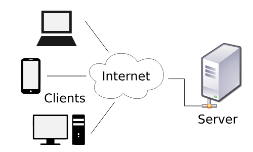
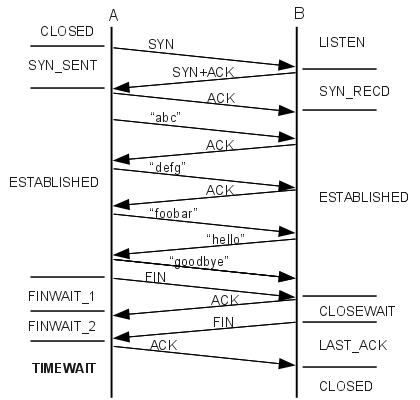

# TCP-Based Controlled Messaging Application

## System Overview

The proposed system is a controlled messaging application where a central server hosted on an old laptop manages all client communications. Only authorized users, approved by the server administrator, are allowed to exchange messages. The system uses the TCP protocol to ensure reliable and ordered message delivery.
The system is a centralized messaging application where an old laptop is permanently configured as a dedicated server.
Unlike LAN-based systems, clients connect to the server over the Internet, not necessarily from the same network.

### The server:

**Maintains user authentication**

**Controls who can message**

**Stores user data and messages**

**Routes messages using TCP connections**

```python
Client (Anywhere)
        |
        |  Internet (TCP)
        |
Router (Public IP + Port Forwarding)
        |
Home Server (Server)
        |
     Database
``` 
Clients do NOT need to be on the same Wi-Fi or LAN

## Role

Acts as a central messaging server

Always running

Exposed to the internet via router

## Responsibilities

Accept remote TCP connections

Authenticate users

Authorize messaging permissions

Route messages

Manage database

## Server Subsystems

Network Listener

Authentication Manager

Session Manager

Message Router

Database Manager

## Router / Network Gateway (Very Important)

Responsibilities

Assigns public IP

Performs port forwarding

Routes internet traffic to server laptop

```python
Public IP: 49.xxx.xxx.xxx
Forward Port: 5000 → 192.168.1.100:5000
```
This is what allows outside clients to reach the server.

## Client Applications

### Role

Connect to server using public IP/domain

Authenticate

Send & receive messages

### Client Location

Different Wi-Fi networks

Mobile hotspot

Different cities (in theory)

## Database

### Purpose

User credentials

Access permissions

Message logs (optional)

### Control

Fully managed by server admin (you)

## Connection & Authentication Design


## Step-by-Step Flow

Client initiates TCP connection to public IP

Router forwards traffic to server laptop

Server accepts connection

Client sends login credentials

Server verifies user from database

Server allows or rejects connection

## Authorization & Control Design
### Access Control

#### Only pre-approved users can:

Stay connected

Send messages

Receive messages

### Admin Privileges

#### You decide:

Who can register

Who can message

Who gets blocked

## Security Design (Basic but Sufficient)
### Implemented

Authentication-based access

Server-controlled permissions

TCP reliability

### Recommended Enhancements

Password hashing

IP-based throttling

Basic encryption (future scope)